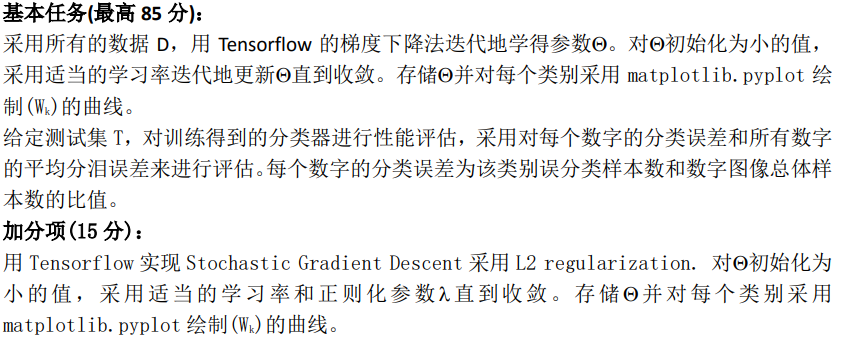
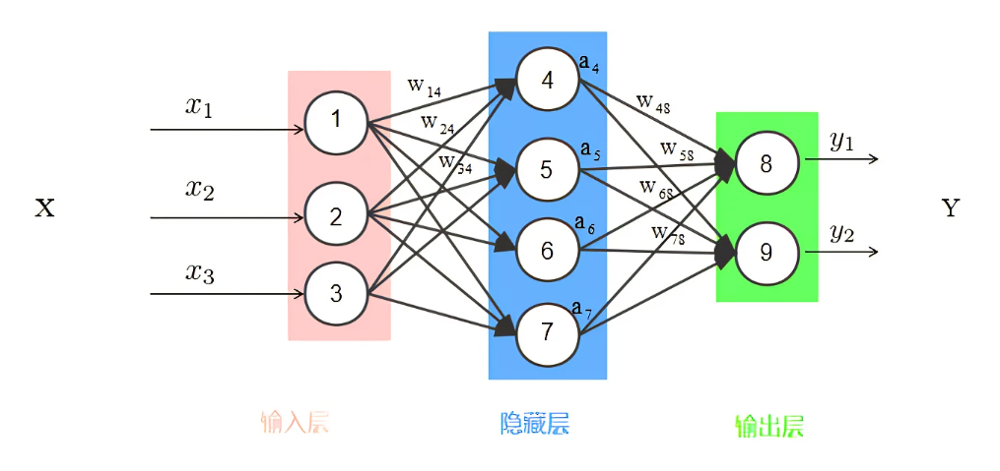
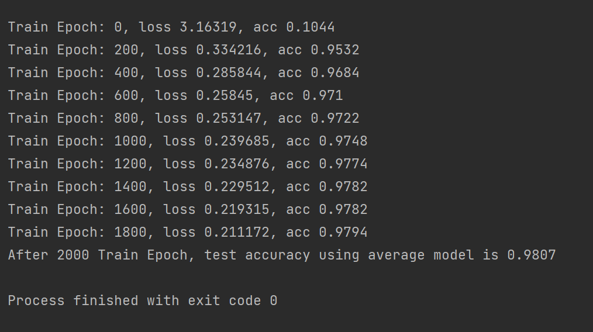
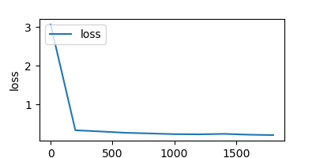
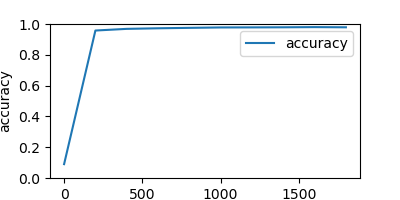

# 基于梯度下降法的手写数字识别

## 一、实验背景

项目实践期中大作业，实验采用MINST手写字符集作为识别对象。其中60000张作为训练集，剩余10000张作为测试集。其任务如下



## 二、实验目的

利用梯度下降算法实现手写数字识别，当输入一张手写图片后，能够准确的识别出该图片中数字是几。输出内容是0、1、2、3、4、5、6、7、8、9的其中一个。

## 三、实验原理

- 采用用全连接神经网络训练
  全连接神经网络模型是一种多层感知机(MLP)，感知机的原理是寻找类别间最合理、最具有鲁棒性的超平面，感知机最具代表的是SVM支持向量机算法。神经网络同时借鉴了感知机和仿生学，通常来说，动物神经接受一个信号后会发送各个神经元，各个神经元接受输入后根据自身判断，激活产生输出信号后汇总从而实现对信息源实现识别、分类，一个典型的神经网络如下图所示：

  

  上图是典型的全连接神经网络模型(DNN),有的场合也称作深度神经网络，与传统的感知机不同，每个结点和下一层所有结点都有运算关系，这就是名称中‘全连接’的含义，在实践中全连接神经网络通常有多个隐藏层，增加隐藏层可以更好分离数据的特征，但过多的隐藏层也会增加训练时间以及产生过拟合。
  在训练全连接神经网络时，先是通过前向传播，得到预测结果，再反向传播去调整模型权重。

- 反向传播
  反向传播根据前向传播产生的损失函数值，沿输出端向至输入端优化每层之间参数，在此过程中运算利用梯度下降法优化参数，神经网络求解参数本质上仍然是规划中求最优解问题。
- 训练mnist手写数字识别
  利用交叉熵作为损失函数实现对minist数据集的识别，minist数据集是手写数字的图像样本，DNN识别图像的过程就是把图像正确的归为0-9这10个数字，所以这是一个分类算法的实现。

## 四、实验环境

| CPU      | 12th Gen Intel(R) Core(TM) i5-12500H   3.10 GHz |
| -------- | ----------------------------------------------- |
| GPU      | RTX3050                                         |
| 主存     | 16.0 GB (15.7 GB 可用)                          |
| 操作系统 | Windows 11 家庭中文版                           |
| CUDA     | CUDA11.2                                        |
| 编程语言 | Python                                          |
| 框架     | TensorFlow 2.6.0                                |

## 五、实验说明

### 参数设置

```
INPUT_NODE = 784  # 输入层的节点数。对于MNIST 数据集,这个就等于图片的像素。
OUTPUT_NODE = 10  # 输出层的节点数。这个等于类别的数目。因为在MNIST数据集中需要区分的是0~9这10 个数字,所以这里输出层的节点数为10。
LAYER1_NODE = 500  # 隐藏层节点数。这里使用只有一个隐藏层的网络结构作为样例。这个隐藏层有500 个节点
BATCH_SIZE = 100  # 一个训练batch 中的训练数据个数。数字越小时，训练过程越接近随机梯度下降; 数字越大时，训练越接近梯度下降。
LEARNING_RATE_BASE = 0.8  # 基础的学习率
LEARNING_RATE_DECAY = 0.99  # 学习率的衰减率
REGULARAZTION_RATE = 0.0001  # 描述模型复杂度的正则化项在损失函数中的系数。
TRAINING_STEPS = 2000  # 训练轮数。
MOVING_AVERAGE_DECAY = 0.99  # 滑动平均衰减率。
TRAINING_OUTPUT_STEPS = 200  # 隔多少轮输出一次结果
epoch_list = []  # 画图所用的列表，用来存储轮数
accuracy_list = []  # 画图所用发的列表，用来存储精准度
loss_list = []  # 画图所用的列表，用来存储损失
```

### 实验流程

程序大体上可分为数据加载、数据预处理、建立全连接层、梯度下降和数据测试5个子模块，输出结果。给出交叉熵误差计算方式，并用交叉熵误差对参数求梯度来更新参数值。

### 其他说明

由于我的CUDA版本过高没有与之匹配的Tensorflow版本并且MINST数据集较小，所以我用的是CPU跑的，推荐用GPU，GPU要比CPU快得多。

## 六、实验过程（代码实现）

### 导包和定义参数

```
import tensorflow as tf
from tensorflow.examples.tutorials.mnist import input_data
import matplotlib.pyplot as plt

INPUT_NODE = 784  # 输入层的节点数。对于MNIST 数据集,这个就等于图片的像素。
OUTPUT_NODE = 10  # 输出层的节点数。这个等于类别的数目。因为在MNIST数据集中需要区分的是0~9这10 个数字,所以这里输出层的节点数为10。
LAYER1_NODE = 500  # 隐藏层节点数。这里使用只有一个隐藏层的网络结构作为样例。这个隐藏层有500 个节点
BATCH_SIZE = 100  # 一个训练batch 中的训练数据个数。数字越小时，训练过程越接近随机梯度下降; 数字越大时，训练越接近梯度下降。
# 模型相关的参数
LEARNING_RATE_BASE = 0.8  # 基础的学习率
LEARNING_RATE_DECAY = 0.99  # 学习率的衰减率
REGULARAZTION_RATE = 0.0001  # 描述模型复杂度的正则化项在损失函数中的系数。
TRAINING_STEPS = 2000  # 训练轮数。
MOVING_AVERAGE_DECAY = 0.99  # 滑动平均衰减率。
TRAINING_OUTPUT_STEPS = 200  # 隔多少轮输出一次结果
epoch_list = []  # 画图所用的列表，用来存储轮数
accuracy_list = []  # 画图所用发的列表，用来存储精准度
loss_list = []  # 画图所用的列表，用来存储损失
```

### 定义辅助函数

```
def inference(input_tensor, avg_class, weights1, biases1, weights2, biases2):
    # 当没有提供滑动平均类时，直接使用参数当前的取值
    if avg_class == None:
        # 计算隐藏层的前向传播结果，这里使用了ReLU 激活函数。
        layer1 = tf.nn.relu(tf.matmul(input_tensor, weights1) + biases1)
        # 计算输出层的前向传播结果。因为在计算损失函数时会一并计算softmax函数,
        # 所以这里不需要加入激活函数。而且不加入softmax 不会影响预测结果。因为预测时
        # 使用的是不同类别对应节点输出值的相对大小，有没有softmax 层对最后分类结果的
        # 计算没有影响。于是在计算整个神经网络的前向传播时可以不加入最后的softmax 层。
        return tf.matmul(layer1, weights2) + biases2
    else:
        # 首先使用avg_class.average 函数来计算得出变量的滑动平均值，
        # 然后再计算相应的神经网络前向传播结果
        layer1 = tf.nn.relu(tf.matmul(input_tensor, avg_class.average(weights1)) + avg_class.average(biases1))
        return tf.matmul(layer1, avg_class.average(weights2)) + avg_class.average(biases2)
```

一个辅助函数，给定神经网络的输入和所有参数，计算神经网络的前向传播结果。在这里定义了一个使用ReLU激活函数的三层全连接神经网络。通过加入隐藏层实现了多层网络结构，通过ReLU 激活函数实现了去线性化。在这个函数中也支持传入用于计算参数平均值的类，这样方便在测试时使用滑动平均模型。

### 训练过程

包括对数据进行预处理，梯度下降，数据测试，画图等操作

```
def train(mnist):
    x = tf.placeholder(tf.float32, [None, INPUT_NODE], name='x-input')
    y_ = tf.placeholder(tf.float32, [None, OUTPUT_NODE], name='y-input')
    # 生成隐藏层的参数。
    weights1 = tf.Variable(tf.truncated_normal([INPUT_NODE, LAYER1_NODE], stddev=0.1))
    biases1 = tf.Variable(tf.constant(0.1, shape=[LAYER1_NODE]))
    # 生成输出层的参数。
    weights2 = tf.Variable(tf.truncated_normal([LAYER1_NODE, OUTPUT_NODE], stddev=0.1))
    biases2 = tf.Variable(tf.constant(0.1, shape=[OUTPUT_NODE]))
    # 计算在当前参数下神经网络前向传播的结果。这里给出的用于计算滑动平均的类为None,
    # 所以函数不会使用参数的滑动平均值
    y = inference(x, None, weights1, biases1, weights2, biases2)
    # 定义存储训练轮数的变量。这个变量不需要计算滑动平均值，所以这里指定这个变量为
    # 不可训练的变量(trainable=Fasle)。在使用TensorFlow 训练神经网络时，
    # 一般会将代表训练轮数的变量指定为不可训练的参数。
    global_step = tf.Variable(0, trainable=False)
    # 给定滑动平均衰减率和训练轮数的变量，初始化滑动平均类。给
    # 定训练轮数的变量可以加快训练早期变量的更新速度。
    variable_averages = tf.train.ExponentialMovingAverage(MOVING_AVERAGE_DECAY, global_step)
    # 在所有代表神经网络参数的变量上使用滑动平均。其他辅助变量(比如global_step) 就
    # 不需要了。tf.trainable_variables 返回的就是图上集合
    variables_averages_op = variable_averages.apply(tf.trainable_variables())
    # 计算使用了滑动平均之后的前向传播结果。滑动平均不会改变变量本身的取值，
    # 而是会维护一个影子变量来记录其滑动平均值。所以当需要使用这个滑动平均值时，
    # 需要明确调用average 函数。
    average_y = inference(x, variable_averages, weights1, biases1, weights2, biases2)
    # 计算交叉熵作为刻画预测值和真实值之间差距的损失函数。这里使用了TensorFlow 中提
    # 供的sparse softmax cross_entropy with logits 函数来计算交叉熵。当分类
    # 问题只有一个正确答案时，可以使用这个函数来加速交叉熵的计算。MNIST 问题的图片中
    # 只包含了0~9 中的一个数字，所以可以使用这个函数来计算交叉熵损失。这个函数的第一个
    # 参数是神经网络不包括softmax 层的前向传播结果，第二个是训练数据的正确答案。因为
    # 标准答案是一个长度为10 的一维数组，而该函数需要提供的是一个正确答案的数字，所以需
    # 要使用tf.argmax 函数来得到正确答案对应的类别编号。
    cross_entropy = tf.nn.sparse_softmax_cross_entropy_with_logits(logits=y, labels=tf.argmax(y_, 1))
    # 计算在当前batch 中所有样例的交叉熵平均值。
    cross_entropy_mean = tf.reduce_mean(cross_entropy)
    # 计算L2 正则化损失函数。
    regularizer = tf.contrib.layers.l2_regularizer(REGULARAZTION_RATE)
    # 计算模型的正则化损失。一般只计算神经网络边上权重的正则化损失，而不使用偏置项。
    regularaztion = regularizer(weights1) + regularizer(weights2)
    # 总损失等于交叉熵损失和正则化损失的和。
    loss = cross_entropy_mean + regularaztion
    # 设置指数衰减的学习率
    learning_rate = tf.train.exponential_decay(
        LEARNING_RATE_BASE,  # 基础的学习率，随着迭代的进行，更新变量时使用的学习率在这个基础上递减。
        global_step,  # 当前迭代的轮数
        mnist.train.num_examples / BATCH_SIZE,  # 过完所有的训练数据需要的迭代次数
        LEARNING_RATE_DECAY,  # 学习率衰减速度
        staircase=True)
    # 使用tf.train.GradientDescentOptimizer 优化算法来优化损失函数。注意这里损失函数
    # 包含了交叉熵损失和L2 正则化损失。
    train_step = tf.train.GradientDescentOptimizer(learning_rate).minimize(loss, global_step=global_step)
    # 在训练神经网络模型时，每过一遍数据既需要通过反向传播来更新神经网络中的参数，
    # 又要更新每一个参数的滑动平均值。为了一次完成多个操作，TensorFlow 提供了两种机制
    with tf.control_dependencies([train_step, variables_averages_op]):
        train_op = tf.no_op(name='train')
    # 检验使用了滑动平均模型的神经网络前向传播结果是否正确。tf.argmax (average_ y,1)
    # 计算每一个样例的预测答案。其中average_y 是一个batch_size * 10 的二维数组，每一行
    # 表示一个样例的前向传播结果。tf.argmax 的第二个参数“1”表示选取最大值的操作仅在第一
    # 个维度中进行，也就是说，只在每一行选取最大值对应的下标。于是得到的结果是一个长度为
    # batch 的一维数组，这个一维数组中的值就表示了每一个样例对应的数字识别结果。tf.equal
    # 判断两个张量的每一维是否相等，如果相等返回True,否则返回False。
    correct_prediction = tf.equal(tf.argmax(average_y, 1), tf.argmax(y_, 1))
    # 这个运算首先将一个布尔型的数值转换为实数型，然后计算平均值。这个平均值就是模型在这
    # 一组数据上的正确率。
    accuracy = tf.reduce_mean(tf.cast(correct_prediction, tf.float32))
    # 初始化会话，并开始训练过程。
    with tf.Session() as sess:
        tf.global_variables_initializer().run()
        # 准备验证数据。一般在神经网络的训练过程中会通过验证数据来大致判断停止的条件和评判训练的效果。
        validate_feed = {x: mnist.validation.images, y_: mnist.validation.labels}
        # 准备测试数据。在真实的应用中，这部分数据在训练时是不可见的，这个数据只是作为模型优劣的最后评价标准。
        test_feed = {x: mnist.test.images, y_: mnist.test.labels}
        # 循环的训练神经网络。
        for i in range(TRAINING_STEPS):
            if i % TRAINING_OUTPUT_STEPS == 0:
                # 计算滑动平均模型在验证数据上的结果。因为MNIST 数据集比较小，所以一次
                # 可以处理所有的验证数据。为了计算方便，本样例程序没有将验证数据划分为更
                # 小的batch。当神经网络模型比较复杂或者验证数据比较大时，太大的batch
                # 会导致计算时间过长甚至发生内存溢出的错误。
                validate_loss,validate_acc = sess.run([loss,accuracy], feed_dict=validate_feed)
                epoch_list.append(i)
                accuracy_list.append(validate_acc)
                loss_list.append(validate_loss)
                print("Train Epoch: %d, loss %g, acc %g " % (i,validate_loss,validate_acc))
            # 产生这一轮使用的一个batch 的训练数据，并运行训练过程。
            xs, ys = mnist.train.next_batch(BATCH_SIZE)
            sess.run(train_op, feed_dict={x: xs, y_: ys})
        # 在训练结束之后，在测试数据上检测神经网络模型的最终正确率。
        test_acc = sess.run(accuracy, feed_dict=test_feed)
        print(("After %d training step(s), test accuracy using average model is %g" % (TRAINING_STEPS, test_acc)))
        plt.plot(epoch_list, accuracy_list, label="accuracy")
        fig = plt.gcf()
        fig.set_size_inches(4, 2)
        # plt.ylim(0.8, 1) #因为训练数据太少所以准确度没有达到0.8以上所以一开始没哟显示
        plt.ylim(0, 1)  # 设置只查看的范围
        plt.ylabel('accuracy')
        plt.xlabel('epoch')
        plt.legend()
        plt.show()
        fig = plt.gcf()
        fig.set_size_inches(4, 2)
        plt.plot(epoch_list, loss_list, label='loss')
        plt.ylabel('loss')
        plt.xlabel('epoch')
        plt.legend(['loss'], loc='upper left')
        plt.show()
```

### 主函数入口

其作用是加载数据集，调用train方法

```
def main(argv=None):
    # 声明处理MNIST 数据集的类，这个类在初始化时会自动下载
    mnist = input_data.read_data_sets("/tmp/data", one_hot=True)
    train(mnist)
    # Tensorflow 提供的一个主程序入口，tf.app.run 会调用上面定义的main函数
    
if __name__ == '__main__':
    tf.app.run()
```

## 七、实验结果

### 文字输出



可以看到经过2000轮的训练，测试准确率已经高达98.07%，可以说是非常成功

### 图像输出





可以看到loss正在逐步下降，accuracy逐步上升

## 八、总结

以上便是本实验的所有内容，后续还将进一步优化。